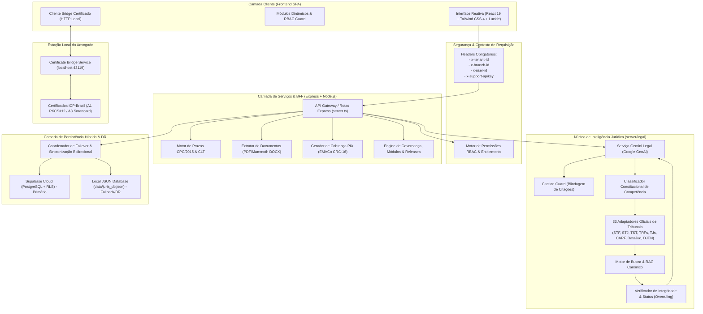
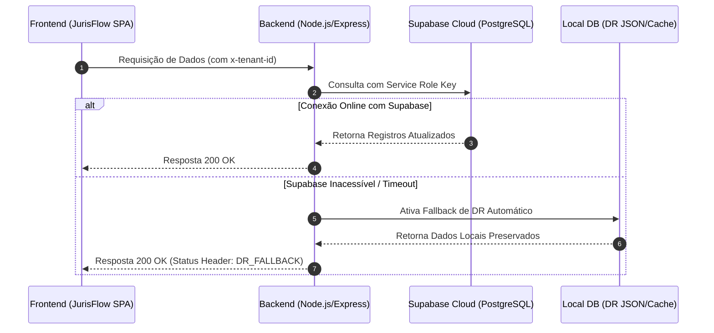
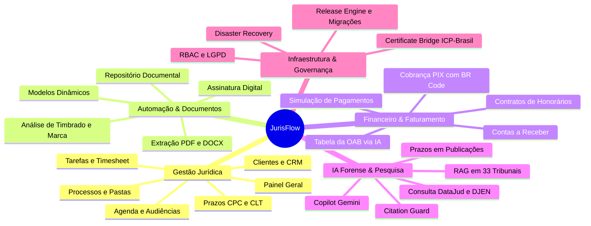
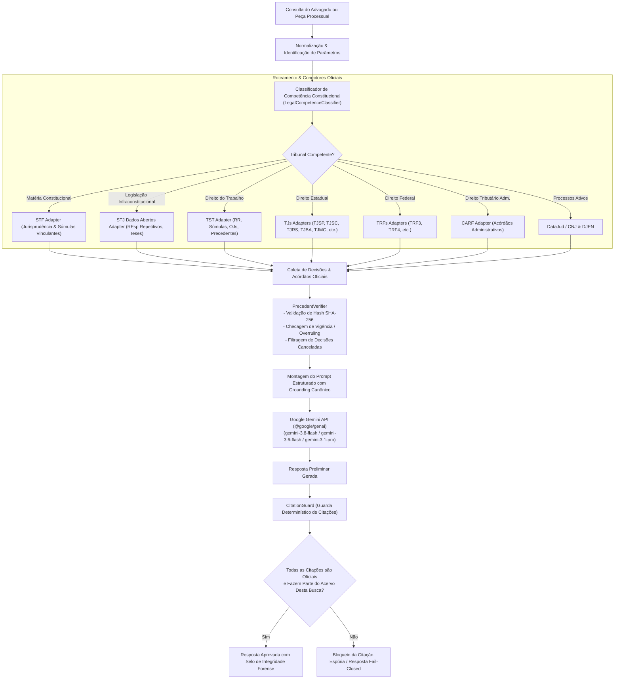
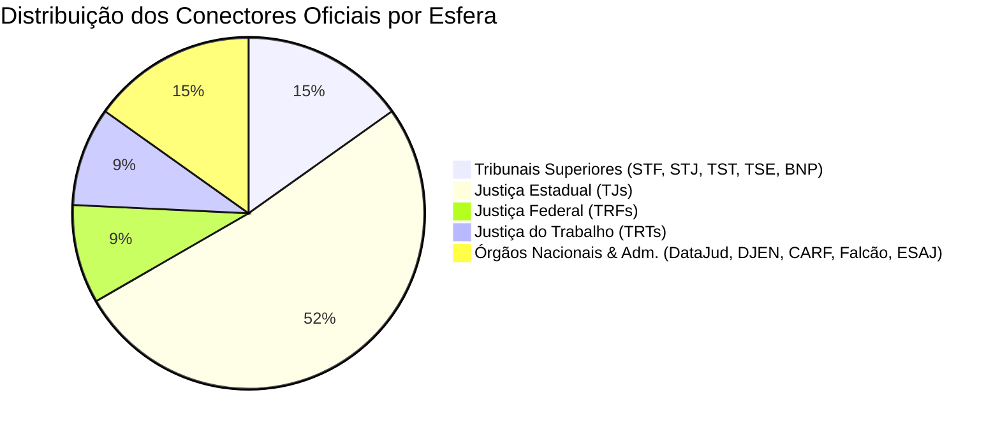

# JurisFlow — Arquitetura de Software e Guia Completo de Features

> **Documento Oficial de Engenharia e Especificação Funcional**  
> **Versão do Sistema:** 1.3.0  
> **Data de Análise:** Setembro de 2026  
> **Status:** Ativo / Produção

---

## Sumário Executivo

O **JurisFlow** é uma plataforma SaaS (*Software as a Service*) jurídica *multi-tenant* de alta densidade funcional, desenhada para modernizar, automatizar e blindar a prática forense de escritórios de advocacia e departamentos jurídicos corporativos.

O ecossistema integra em um único ambiente:
1. **Gestão Operacional e CRM Jurídico:** Fichas de clientes (PF/PJ), processos, movimentações, prazos processuais com contagem CPC/CLT em dias úteis, audiências, diligências, tarefas e timesheet.
2. **Central Documental e Automação de Minutas:** Geração de peças e contratos com tags dinâmicas, extração de texto de petições/PDFs/DOCX e assinatura digital interna com metadados forenses.
3. **Gestão Financeira Especializada:** Contratos de honorários (fixo, êxito, retainer, hora), parcelamentos, conciliação bancária, emissão de cobranças PIX instantâneo com BR Code oficial e cartão/boleto via Mercado Pago.
4. **Inteligência Artificial Forense de Alta Confiabilidade (Gemini Enterprise for Legal):** Copilot jurídico alimentado pelo Google Gemini integrado a um motor de RAG (*Retrieval-Augmented Generation*) com **Grounding em Fontes Oficiais**, **Citation Guard** (blindagem estrita contra alucinação de jurisprudência inexistente) e política de falha fechada (*Fail-Closed*).
5. **Pesquisa Jurídica Unificada e Integração com Tribunais:** Consulta processual integrada ao DataJud (CNJ), varredura do Diário de Justiça Eletrônico Nacional (DJEN), conectores federados para 33 fontes e tribunais do Brasil (STF, STJ, TST, TSE, TRFs, TRTs, TJs e CARF).
6. **Certificate Bridge ICP-Brasil:** Ponte local segura (`127.0.0.1:43119`) para interação com certificados digitais A1 e A3 sem que a chave privada jamais saia da estação de trabalho do advogado.
7. **Resiliência, Disaster Recovery e Governança:** Topologia multi-database híbrida (Supabase Cloud PostgreSQL primário + Nó Local de DR offline com failover automático/manual), controle de acesso granular baseado em funções (RBAC), auditoria imutável (LGPD) e motor de atualizações do sistema (*Release Engine*) com manifestos criptográficos e verificação SHA-256.

---

## 1. Visão Geral da Arquitetura

A arquitetura do JurisFlow adota o padrão **BFF (Backend-for-Frontend)** com **Single Page Application (SPA)** desacoplada no frontend e um servidor Node.js/Express de alto desempenho no backend, operando em modelo **Multi-Tenant com Isolamento Lógico Estrito**.

### 1.1 Diagrama Macro de Arquitetura



---

## 2. Padrões de Arquitetura e Engenharia de Software

### 2.1 Multi-Tenancy e Isolamento de Dados

O JurisFlow implementa um modelo de **Multi-Tenancy por Particionamento Lógico**, onde toda requisição HTTP deve conter os seguintes cabeçalhos de contexto forense:

| Header | Descrição | Finalidade |
| :--- | :--- | :--- |
| `x-tenant-id` | Identificador único do escritório contratante | Garante isolamento estrito de todos os registros entre escritórios. |
| `x-branch-id` | Identificador da filial (ex: Matriz SP, Filial RJ) | Permite gestão multi-unidades, rateio de custos e segmentação de equipes. |
| `x-user-id` | Identificador do usuário solicitante | Usado para autenticação de contexto, auditoria de ações e timesheet. |
| `x-support-apikey` | Token temporário de suporte autenticado | Permite que a equipe de suporte acesse dados apenas mediante aprovação expressa do tenant. |

### 2.2 Camada de Persistência Híbrida com Disaster Recovery (DR)

O sistema conta com uma arquitetura de dados tolerante a falhas:
- **Banco Primário na Nuvem:** Supabase Cloud (PostgreSQL gerenciado com *Row-Level Security* - RLS ativo em todas as tabelas).
- **Banco Local de Contingência (DR):** Armazenamento em arquivo local JSON (`data/juris_db.json`) com sincronização em memória (`MemoryDatabase`).
- **Failover / Failback Inteligente:**
  - O sistema monitora continuamente o ping e a latência da conexão com o Supabase.
  - Caso a nuvem fique inacessível, o nó local assume a operação em modo *Offline Resilience*.
  - Quando a conexão é restabelecida, a rota `/api/databases/sync-dr-to-cloud` executa a reconciliação e hidratação das alterações pendentes.



### 2.3 Matriz de Segurança RBAC e Entitlements

O sistema aplica uma política de **Controle de Acesso Baseado em Funções (RBAC)** integrada a um motor de **Entitlements por Plano de Assinatura**:

$$\text{Acesso Autorizado} = (\text{Plano Permite}) \land (\text{Módulo Ativo}) \land (\text{Feature Flag Habilitada}) \land (\text{Usuário Possui Permissão})$$

#### Tiers de Plano
1. **STARTER:** Dashboard, CRM de Clientes, Gestão de Casos/Processos, Prazos CPC, Agenda básica e Central de Documentos.
2. **PROFESSIONAL:** Módulo Financeiro completo, Emissão de Cobranças PIX/Boleto, Timesheet faturável, Modelos de Petições, Relatórios Gerenciais e Auditoria de Acessos.
3. **PREMIUM / ENTERPRISE:** IA Jurídica (Gemini Enterprise for Legal com RAG e Citation Guard), Consulta Processual Unificada DataJud/DJEN, Integração com 33 Tribunais, Multi-Database DR e Suporte a Certificados Digitais.

#### Perfis de Usuário (Roles)
- `SUPER_ADMIN`: Administrador global da plataforma SaaS (gestão de tenants, feature flags, release engine, migrações).
- `SOCIO_ADMIN`: Sócio administrador do escritório (acesso total às filiais, relatórios de rentabilidade, configurações e faturamento).
- `ADVOGADO_SENIOR` / `ADVOGADO_PLENO`: Condução de processos, redação de peças, audiências, prazos e uso do Copilot IA.
- `ADVOGADO_JUNIOR` / `ESTAGIARIO`: Apoio operacional, controle de prazos e pesquisas jurisprudenciais (bloqueados de dados financeiros e configurações).
- `FINANCEIRO`: Gestão de contas a receber, faturamento de timesheet, emissão de PIX e conciliação (bloqueado de autos processuais e peças confidenciais).
- `SECRETARIA`: Atendimento, recepção de clientes, cadastro de leads e controle de agenda de compromissos.

---

## 3. Módulos do Sistema e Funcionalidades Detalhadas



### 3.1 Painel Geral (Dashboard)
- **Métricas Executivas em Tempo Real:** Total de processos ativos, volume financeiro a receber no mês, novos clientes no período e índice de cumprimento de prazos.
- **Prazos do Dia e da Semana:** Visão prioritária em formato kanban/cards dos prazos processuais com badges de urgência (urgente, hoje, próximo).
- **Próximas Audiências:** Linha do tempo dos atos presenciais e virtuais agendados.
- **Tarefas da Equipe:** Distribuição de tarefas pendentes por advogado responsável.

### 3.2 Clientes & CRM Jurídico
- **Cadastro Unificado:** Suporte completo para Pessoas Físicas (CPF, RG, profissão, estado civil, endereço) e Pessoas Jurídicas (CNPJ, razão social, nome fantasia, representantes legais).
- **Pipeline de Leads & Prospecção:** Funil de vendas para qualificação de potenciais clientes desde o primeiro contato até o fechamento do contrato de honorários.
- **Dossiê do Cliente:** Visão 360° reunindo processos vinculados, contratos de honorários vigentes, faturas pendentes, documentos arquivados e histórico de atendimentos.
- **Conformidade LGPD:** Registro explícito de termos de consentimento, finalidade do tratamento de dados e Portal de Privacidade para solicitações de titulares (Art. 18 da LGPD).

### 3.3 Processos & Pastas Judiciais
- **Ficha Processual Completa:**
  - Número de processo padronizado CNJ (`NNNNNNN-DD.AAAA.J.TR.OOOO`).
  - Tribunal de origem, vara, comarca e instância.
  - Partes processuais qualificadas (polo ativo, polo passivo, terceiros interessados).
  - Valor da causa, rito processual e área do direito (Cível, Trabalhista, Tributário, Família, etc.).
- **Histórico de Movimentações (Timeline):** Linha do tempo cronológica com badges visuais por tipo de andamento (despacho, decisão, sentença, certidão).
- **Associação de Precedentes e Jurisprudência:** Capacidade de vincular acórdãos e súmulas diretamente à pasta do processo para embasar futuras manifestações.

### 3.4 Prazos Processuais & Calculadora CPC/CLT
- **Motor Fiel ao CPC/2015 e CLT:**
  - Contagem exclusiva em **dias úteis** (Art. 219 do CPC/2015 e Art. 775 da CLT).
  - Regra de exclusão do dia do começo e inclusão do dia do vencimento (Art. 224 do CPC).
  - **Recesso Forense Automatizado:** Suspensão automática de prazos entre 20 de dezembro e 20 de janeiro (Art. 220 do CPC).
- **Calendário Dinâmico de Feriados Nacionais e Forenses:**
  - Feriados fixos (Confraternização, Tiradentes, Trabalho, Dia do Advogado [11 de agosto], Independência, Padroeira, Servidor Público, Finados, República, Consciência Negra [20 de novembro], Dia da Justiça [8 de dezembro], Natal).
  - Feriados móveis calculados por algoritmo astronômico/eclesiástico (Segunda e Terça-feira de Carnaval, Quarta-feira de Cinzas, Sexta-feira Santa e Corpus Christi).
- **Alertas Escalonados:** Notificações automáticas aos advogados responsáveis nos intervalos de 5, 3 e 1 dia antes do prazo fatal.

### 3.5 Agenda, Audiências & Diligências
- **Visualização Flexível:** Modos de exibição em Mês, Semana, Dia e Lista cronológica.
- **Tipos de Eventos Jurídicos:** Audiências (Instrução, Conciliação, UNA, Julgamento), perícias judiciais, reuniões com clientes e diligências externas (fóruns, cartórios).
- **Exportação iCal:** Geração de feeds e arquivos `.ics` compatíveis com Google Calendar, Microsoft Outlook e Apple Calendar.

### 3.6 Tarefas, Atividades & Timesheet
- **Gestão de Tarefas Internas:** Atribuição de responsabilidades, prazos de entrega, checklists de conferência e níveis de prioridade.
- **Apontamento de Horas (Timesheet):** Cronometragem precisa ou lançamento manual de horas dedicadas a cada caso/cliente, com classificação entre horas faturáveis e não faturáveis.
- **Faturamento em Lote:** Módulo integrado que agrupa horas apontadas e gera automaticamente um contrato ou conta a receber baseado no valor/hora cadastrado.

### 3.7 Central de Documentos & Modelos de Peças
- **Repositório Digital Centralizado:** Armazenamento seguro de peças, procurações, documentos pessoais e provas com metadados de classificação.
- **Extração Inteligente de Texto:** Leitura e indexação instantânea de arquivos PDF e Word (.docx) utilizando as bibliotecas `pdf-parse` e `mammoth`.
- **Motor de Templates com Substituição por Tags:** Criação de minutas padronizadas contendo marcadores dinâmicos como:
  - `{{cliente.nome}}`, `{{cliente.cpf}}`, `{{cliente.endereco}}`
  - `{{caso.numero}}`, `{{caso.tribunal}}`, `{{caso.vara}}`
  - `{{advogado.nome}}`, `{{advogado.oab}}`
- **Assinatura Digital Interna:** Aplicação de carimbo digital de autenticidade com hash SHA-256, metadados do signatário e registro auditável.
- **Analisador de Identidade Visual e Papel Timbrado:** Extração automática de dados institucionais, logotipos e paletas de cores a partir de arquivos PDF enviados pelo escritório para customização do cabeçalho e rodapé dos documentos.

### 3.8 Módulo Financeiro & Honorários Advocatícios
- **Modalidades de Contratos de Honorários:**
  - *Pro Labore* (valor fixo parcelado ou à vista).
  - *Ad Exitum* (honorários de êxito atrelados ao ganho econômico da causa).
  - *Honorários Sucumbenciais* (decorrentes da condenação da parte contrária).
  - *Retainer / Partido Mensal* (assessoria contínua para empresas).
  - *Hora Técnica* (cobrança baseada no timesheet).
- **Cobrança Instantânea PIX:** Geração nativa de código BR Code oficial (*Pix Copia e Cola*) com cálculo determinístico de CRC-16 (padrão EMVCo) e chave Pix configurável por tenant.
- **Integração com Mercado Pago:** Emissão de cobranças com suporte a boleto bancário registrado e cartão de crédito, com simulador de pagamento para testes de conciliação.
- **Estimativa de Honorários via Tabela da OAB:** Sugestão inteligente de precificação consultando tabelas de seccionais da OAB via modelo de IA.

---

## 4. O Motor de IA Jurídica: Gemini Enterprise for Legal

A camada de inteligência artificial do JurisFlow foi desenvolvida para atender aos mais rigorosos padrões de segurança jurídica, ética e conformidade forense.

### 4.1 Arquitetura do Copilot Jurídico e Pipeline RAG



### 4.2 O Princípio do Citation Guard e Filosofia Fail-Closed

O maior desafio da aplicação de LLMs no Direito é a alucinação de jurisprudência (a geração de números de acórdãos, relatores ou teses inexistentes). O JurisFlow neutraliza essa vulnerabilidade através de dois componentes centrais:

#### 1. Citation Guard (`server/legal/citationGuard.ts`)
- **Validação Contra Acervo Exclusivo:** O Citation Guard valida as citações geradas **apenas e tão somente** contra os julgados efetivamente recuperados dos órgãos oficiais para aquela consulta específica.
- **Correspondência Estrita:** Rejeita correspondências parciais ou flexíveis. Exige correspondência precisa de classe, número, estado e órgão julgador (ex: `REsp 1.061.530/RS`, `RR-1000-12.2020.5.02.0001`, `Súmula Vinculante 13`).
- **Selo de Verificação Inviolável:** Quando aprovada, a citação recebe o selo estruturado de verificação com link oficial auditado. Se a IA citar uma decisão não verificada, o trecho é automaticamente substituído por um aviso de bloqueio preventivo.

#### 2. Matriz de Falha Fechada (Fail-Closed Explanations)
Se uma fonte oficial falhar ou não retornar julgados legítimos, o sistema **não tenta prever ou inventar uma resposta**:

| Código de Falha | Título | Ação do Sistema |
| :--- | :--- | :--- |
| `NO_RELEVANT_PRECEDENT` | Nenhum Precedente Oficial Pertinente | Informa que a busca foi realizada com sucesso mas não há julgado aplicável com aderência material estrita. |
| `SOURCE_UNAVAILABLE` | Fonte Oficial Indisponível | Alerta que o portal de dados abertos do tribunal está fora do ar. |
| `DOCUMENT_REJECTED` | Precedente Rejeitado pelo Verificador | Julgado descartado por ter sido cancelado ou superado (*overruling*). |
| `EXCLUDED_BY_JURISDICTION` | Fonte Excluída por Incompetência | Impede busca em tribunais sem competência constitucional para a matéria (CF/88). |
| `MODEL_UNAVAILABLE` | Síntese de IA Indisponível | Entrega diretamente os cartões estruturados dos julgados oficiais sem a síntese em texto livre. |

### 4.3 Funcionalidades Específicas do Copilot
1. **Extração Automática de Prazos em Publicações:** Recebe o texto ou PDF de uma intimação do Diário Oficial, identifica o tipo de ato (intimação, citação, acórdão), calcula os prazos em dias úteis com base no CPC e gera a tarefa na agenda com um clique.
2. **Redação Assistida de Peças (Draft Piece):** Redige minutas estruturadas (Iniciais, Contestações, Agravos, Recursos Especiais) a partir dos fatos narrados, teses indicadas e partes do processo.
3. **Resumo Executivo de Processos (Case Summary):** Analisa a íntegra dos autos e gera um sumário executivo com controvérsias pendentes, pedidos e histórico decisório.
4. **Auditoria de Conformidade Documental (Audit Document):** Avalia contratos e petições em busca de cláusulas nulas, contradições lógicas, erros materiais e riscos de prescrição.
5. **Sanitização de Modelos Reais:** Converte petições reais utilizadas no dia a dia do escritório em modelos parametrizados, trocando nomes próprios, CPFs e dados sensíveis pelas tags dinâmicas do sistema.

---

## 5. Matriz de Conectores e Tribunais Oficiais

O JurisFlow possui **33 adaptadores** especializados para busca federada de jurisprudência e andamentos processuais:



### Lista Completa de Adaptadores Implementados (`server/legal/adapters/`)
1. **DataJudAdapter:** Consulta processual unificada pelo CNJ (Conselho Nacional de Justiça).
2. **DjenPublicationsAdapter:** Busca e monitoramento de intimações no Diário de Justiça Eletrônico Nacional.
3. **BnpAdapter:** Banco Nacional de Precedentes do CNJ.
4. **StfJurisprudenciaAdapter:** Supremo Tribunal Federal (Súmulas Vinculantes, Repercussão Geral, ADIs, REs).
5. **StjDadosAbertosAdapter:** Superior Tribunal de Justiça (Recursos Repetitivos, Temas e Jurisprudência em Teses).
6. **TstJurisprudenciaAdapter:** Tribunal Superior do Trabalho (Recursos de Revista, AIRR, Súmulas e OJs).
7. **TstNormativeCollectionAdapter:** Coleção normativa e precedentes normativos do TST.
8. **TseJurisprudenciaAdapter:** Tribunal Superior Eleitoral.
9. **CarfJurisprudenciaAdapter:** Conselho Administrativo de Recursos Fiscais (Acórdãos tributários federais).
10. **Trf3JurisprudenciaAdapter:** Tribunal Regional Federal da 3ª Região (SP/MS).
11. **Trf4JurisprudenciaAdapter:** Tribunal Regional Federal da 4ª Região (RS/SC/PR).
12. **Trt2JurisprudenciaAdapter:** Tribunal Regional do Trabalho da 2ª Região (Grande SP e Litoral).
13. **Trt15PrecedentsAdapter:** Tribunal Regional do Trabalho da 15ª Região (Campinas e Interior de SP).
14. **TjspJurisprudenciaAdapter:** Tribunal de Justiça do Estado de São Paulo.
15. **TjscJurisprudenciaAdapter:** Tribunal de Justiça de Santa Catarina.
16. **TjrsJurisprudenciaAdapter:** Tribunal de Justiça do Rio Grande do Sul.
17. **TjbaJurisprudenciaAdapter:** Tribunal de Justiça da Bahia.
18. **TjceJurisprudenciaAdapter:** Tribunal de Justiça do Ceará.
19. **TjdftJurisprudenciaAdapter:** Tribunal de Justiça do Distrito Federal e Territórios.
20. **TjesJurisprudenciaAdapter:** Tribunal de Justiça do Espírito Santo.
21. **TjmaJurisprudenciaAdapter:** Tribunal de Justiça do Maranhão.
22. **TjpaJurisprudenciaAdapter:** Tribunal de Justiça do Pará.
23. **TjpeJurisprudenciaAdapter:** Tribunal de Justiça de Pernambuco.
24. **TjpiJurisprudenciaAdapter:** Tribunal de Justiça do Piauí.
25. **TjrnJurisprudenciaAdapter:** Tribunal de Justiça do Rio Grande do Norte.
26. **TjroPrecedentesAdapter:** Tribunal de Justiça de Rondônia.
27. **TjrrJurisprudenciaAdapter:** Tribunal de Justiça de Roraima.
28. **TjseJurisprudenciaAdapter:** Tribunal de Justiça de Sergipe.
29. **TjtoJurisprudenciaAdapter:** Tribunal de Justiça do Tocantins.
30. **EsajJurisprudenciaAdapter:** Adaptador genérico para sistemas de tribunais da família e-SAJ.
31. **FalcaoJurisprudenciaAdapter:** Conector para portais baseados no motor Falcão Jurisprudência.
32. **CourtFamilyProbeAdapter:** Diagnóstico e teste de integridade das famílias de portais judiciais.
33. **StateCourtPortalDiagnosticAdapter:** Telemetria de conectividade e resposta das instâncias estaduais.

---

## 6. Ponte de Certificado Digital ICP-Brasil (Certificate Bridge)

Para viabilizar a assinatura digital de peças e a autenticação em sistemas judiciais como PJe, e-SAJ, Projudi e E-proc sem violar normas de segurança, o JurisFlow adota a arquitetura de **Ponte Local (Certificate Bridge)**.

```mermaid
flowchart LR
    subgraph Browser["Navegador Web (JurisFlow)"]
        UI["Tela de Assinatura / Petição"]
    end

    subgraph Localhost["Ambiente Local do Usuário (127.0.0.1:43119)"]
        BridgeServer["tools/certificate-bridge/server.mjs\n(Ponte Node.js Local)"]
        OpenSSL["OpenSSL CLI / OpenSC"]
        CertA1["Arquivo A1 (.pfx/.p12)"]
        TokenA3["Token/Smartcard A3 (PKCS#11 / PC/SC)"]
    end

    subgraph CloudCloud["Servidor na Nuvem / Backend"]
        CloudBackend["Backend JurisFlow (Vercel / Cloud Run)"]
    end

    UI -->|1. Envia documento para hash| CloudBackend
    CloudBackend -->|2. Retorna Hash SHA-256| UI
    UI -->|3. Solicita Assinatura Local (CORS Restrito)| BridgeServer
    BridgeServer -->|4. Valida Certificado via stdin| OpenSSL
    OpenSSL <--> CertA1
    OpenSSL <--> TokenA3
    BridgeServer -->|5. Retorna Assinatura Criptográfica| UI
    UI -->|6. Envia Peça Assinada ao Backend| CloudBackend

    style CloudBackend stroke:#f66,stroke-width:2px,stroke-dasharray: 5 5
    style CertA1 stroke:#6f6,stroke-width:2px
    style TokenA3 stroke:#6f6,stroke-width:2px
```

### Princípios de Segurança do Bridge
1. **Chave Privada Estritamente Local:** A chave privada do certificado ICP-Brasil **jamais trafega pela rede ou para o backend na nuvem**.
2. **Isolamento de Processo:** A ponte escuta exclusivamente no endereço de *loopback* (`127.0.0.1:43119`).
3. **Proteção de Senha:** A senha do certificado A1 é enviada diretamente do navegador para o processo local e repassada ao OpenSSL via `stdin` (evitando exposição em linha de comando ou histórico de processos).
4. **Arquivos Efêmeros:** Arquivos temporários criados para extração são gerados com permissão `0600` e destruídos imediatamente após a assinatura.
5. **Fail-Closed para A3:** Smartcards e tokens A3 exigem a presença dos módulos `OpenSC` e `pcscd`; na ausência deles, a ponte falha de forma segura sem expor dados.

---

## 7. Governança, Release Engine e Administração

O painel administrativo (`/admin`) fornece recursos avançados de sustentação de software em nível de plataforma corporativa:

### 7.1 Registro Dinâmico de Módulos (Module Registry)
Cada capacidade do sistema é registrada com metadados detalhados:
- Identificador único (`id`), nome, versão e categoria (*core*, *operations*, *documents*, *financial*, *intelligence*, *governance*).
- Status em tempo de execução (`ACTIVE`, `INACTIVE`, `MAINTENANCE`).
- Dependências entre módulos (ex: `document-generator` depende de `templates` e `clients`).
- Permissão RBAC mínima necessária e plano de assinatura exigido.

### 7.2 Feature Flags com Rollout Progressivo
Permite ativar ou desativar novas funcionalidades em tempo de execução sem necessidade de *deploy*:
- Controle por ambiente (`development`, `staging`, `production`, `all`).
- Percentual de *rollout* dinâmico (0% a 100%).
- Flags ativas por padrão:
  - `financial.new-dashboard`: Painel financeiro analítico com curvas de fluxo de caixa.
  - `documents.ai-generator`: Redator generativo de cláusulas e petições.
  - `cases.timeline-v2`: Nova linha do tempo processual com selos de tribunais.

### 7.3 Motor de Atualizações do Sistema (System Update Engine)
O JurisFlow possui um mecanismo nativo para gestão e aplicação de novas versões:
- **Manifestos Criptográficos Oficiais (`SystemUpdateManifest`):** Cada versão publicada possui nota de lançamento, lista de alterações (*added*, *changed*, *fixed*, *security*), versão mínima exigida e *checksum* criptográfico SHA-256.
- **Validação Pré-Atualização:** O sistema checa se a integridade do pacote coincide rigorosamente com o hash esperado antes de aplicar qualquer arquivo.
- **Migrações de Banco de Dados Automatizadas:** Execução transacionada de scripts SQL estruturais durante a atualização.
- **Backup e Rollback Seguro:** Geração de *snapshot* de segurança prévio (`backupSnapshotId`), permitindo reversão para a versão anterior em caso de anomalia.

### 7.4 Modo de Produção Protegido (Production Lock)
- Mecanismo que bloqueia comandos de carga de demonstração (*seed*) ou exclusão em lote (*purge*) em ambientes oficiais.
- O escritório oficial padrão da instância é a **Gabriela Capitani Advocacia** (Dra. Gabriela M. Manni Capitani, OAB/SP 478.370), com todas as configurações de pagamento PIX, identidade visual clássica e dados da comarca de Pindamonhangaba/SP pré-configurados.

---

## 8. Estrutura de Diretórios do Projeto

A organização de código do repositório reflete a separação clara de responsabilidades:

```
d:/DEV/AFG-IT/JurisFlow/
│
├── .env.example                     # Modelo de variáveis de ambiente do sistema
├── bun.lock                         # Lockfile do runtime Bun
├── index.html                       # Ponto de entrada SPA do frontend
├── metadata.json                    # Metadados e capacidades da aplicação
├── package.json                     # Manifesto de dependências e scripts NPM
├── tsconfig.json                    # Configuração do compilador TypeScript
├── vite.config.ts                   # Configuração do Vite e plugins Tailwind/React
├── server.ts                        # Servidor principal Node.js/Express (API, BFF, Seed, Rotas)
│
├── data/                            # Camada de dados locais / contingência
│   ├── juris_db.json                # Banco de dados local estruturado (JSON Fallback)
│   ├── juris_legal_knowledge.json   # Base de conhecimento jurídica indexada
│   └── stj_cache/                   # Cache local de dados abertos do STJ
│
├── server/                          # Lógica de backend e serviços de infraestrutura
│   ├── localDb.ts                   # Camada de leitura e persistência em juris_db.json
│   ├── purgeDemoData.ts             # Lógica de limpeza de dados demo e setup de produção limpa
│   ├── supabase.ts                  # Cliente Supabase, mapeamento ORM, sync e diagnóstico RLS
│   ├── migrations/                  # Migrações SQL versionadas
│   │   └── 001_canonical_legal_knowledge.sql # Schema do repositório canônico de jurisprudência
│   └── legal/                       # Camada de Inteligência Jurídica & RAG Oficial
│       ├── citationGuard.ts         # Guarda determinístico de citações (Anti-alucinação)
│       ├── classifier.ts            # Classificador de competência material e constitucional
│       ├── courtFamilies.ts         # Identificador de padrões de portais de tribunais
│       ├── geminiLegalService.ts    # Orquestrador do Google Gemini com Grounding
│       ├── judicialSearchProvider.ts # Provedor de consultas unificadas DataJud e jurisprudência
│       ├── officialSources.ts       # Metadados e endpoints das fontes oficiais brasileiras
│       ├── searchEngine.ts          # Motor de busca semântica e exata de julgados
│       ├── sourceRegistry.ts        # Registro e monitoramento de saúde de conectores
│       ├── stfSecureFetch.ts        # Cliente seguro para consultas no STF
│       ├── storage.ts               # Armazenamento canônico de decisões
│       ├── syncCoordinator.ts       # Coordenador de sincronização incremental de acórdãos
│       ├── tjpeSecureFetch.ts       # Cliente seguro para consultas no TJPE
│       ├── types.ts                 # Tipos TypeScript do ecossistema legal
│       ├── verifier.ts              # Verificador de integridade, hash e vigência de julgados
│       ├── __tests__/               # Testes de regressão e validadores de conectores
│       └── adapters/                # 33 Conectores especializados para tribunais brasileiros
│
├── src/                             # Código-fonte do Frontend (React 19 + TypeScript)
│   ├── App.tsx                      # Componente raiz, controle de navegação e contexto global
│   ├── index.css                    # Estilos globais e diretivas do Tailwind CSS 4
│   ├── main.tsx                     # Ponto de montagem React DOM
│   ├── types/                       # Definições completas de interfaces e tipos do frontend
│   │   └── index.ts                 # Contratos de dados de todas as entidades do sistema
│   ├── services/                    # Clientes de comunicação HTTP e serviços
│   │   ├── api.ts                   # Cliente de API com injeção automática de headers de tenant
│   │   └── certificateBridge.ts     # Cliente de comunicação com a ponte local de certificados
│   ├── lib/                         # Utilitários de lógica de negócio jurídica
│   │   ├── cpcCalendar.ts           # Motor de cálculo de prazos úteis CPC/2015 e feriados
│   │   ├── icalExport.ts            # Utilitário de exportação de agenda em formato iCalendar
│   │   └── pixUtils.ts              # Utilitário gerador de PIX Copia e Cola padrão EMVCo
│   ├── utils/                       # Utilitários gerais do frontend
│   │   ├── entitlements.ts          # Validador de acessos baseado em planos e módulos
│   │   ├── forensicFormatter.ts     # Formatador forense de petições e documentos
│   │   └── rbac.ts                  # Funções de checagem de permissões e controle de roles
│   ├── mock/                        # Carga inicial de dados para desenvolvimento
│   │   └── seedData.ts              # Dados de demonstração estruturados
│   └── components/                  # Componentes de interface do usuário organizados por módulo
│       ├── admin/                   # Painel Administrativo, Módulos, Feature Flags e Updates
│       ├── ai/                      # Central de IA Jurídica (Copilot, Extrator de Prazos, Minutas)
│       ├── calendar/                # Visualizador e editor de Agenda e Audiências
│       ├── cases/                   # Gestão de Processos, Pastas e Linha do Tempo
│       ├── common/                  # Modais comuns, Seletores de Avatar, Login e Acesso Negado
│       ├── crm/                     # Gestão de Clientes (PF/PJ), Leads e Portal LGPD
│       ├── dashboard/               # Painel Principal com métricas gerenciais e cards prioritários
│       ├── documents/               # Central de Documentos, Editor de Templates e Assinatura
│       ├── financial/               # Gestão de Honorários, Contas a Receber, PIX e Tabela OAB
│       ├── layout/                  # Barra lateral (Sidebar), Cabeçalho (Header) e Notificações
│       ├── legal-search/            # Pesquisa Unificada DataJud, Jurisprudência e Certificados
│       ├── settings/                # Configurações do Escritório, Filiais, Identidade Visual e DR
│       ├── support/                 # Modal de emissão de Chaves de Suporte Temporárias
│       └── tasks/                   # Gestão de Tarefas da Equipe e Apontamento de Horas
│
├── tools/                           # Ferramentas auxiliares e microsserviços locais
│   └── certificate-bridge/          # Ponte local para certificados digitais ICP-Brasil
│       ├── README.md                # Documentação técnica de operação da ponte
│       └── server.mjs               # Servidor HTTP local (Node.js) em 127.0.0.1:43119
│
├── scripts/                         # Scripts de manutenção, telemetria e segurança
│   ├── legal-evidence-report.mjs    # Relatório de conformidade de precedentes judiciais
│   ├── scan-secrets.mjs             # Scanner preventivo de credenciais e chaves expostas
│   ├── certificate-bridge/          # Scripts de checagem de pré-requisitos OpenSSL/OpenSC
│   └── legal/                       # Scripts de fumaça e testes de conexão com tribunais
│
└── DOCS/                            # Pasta de Documentação do Projeto
    └── ARQUITETURA_E_FEATURES.md    # Este documento de especificação técnica e funcional
```

---

## 9. Guia de Configuração e Execução

### 9.1 Variáveis de Ambiente (`.env`)

Configure o arquivo `.env` na raiz do projeto com os seguintes parâmetros:

```env
# Inteligência Artificial (Google Gemini)
GEMINI_API_KEY=sua_chave_gemini_aqui
GEMINI_MODEL=gemini-3.8-flash

# Endereço da Aplicação
APP_URL=http://localhost:3000

# Chave Oficial da API Pública do CNJ/DataJud
DATAJUD_API_KEY=c3J2LWNuanByb2Q6T2tEY2x6eXk1OXZyTThx

# Banco de Dados Supabase (PostgreSQL Primário)
SUPABASE_URL=https://suawbaxfgpwyhkykyhka.supabase.co
SUPABASE_SERVICE_ROLE_KEY=sb_secret_...
SUPABASE_SYNC_ON_STARTUP=false
```

### 9.2 Comandos NPM Disponíveis

| Comando | Descrição |
| :--- | :--- |
| `npm run dev` | Inicia o servidor Express de desenvolvimento com hot-reload (tsx) e compilação do Vite integrada. |
| `npm run build` | Compila os ativos estáticos do frontend (Vite) e empacota o servidor Node.js com esbuild para `dist/server.cjs`. |
| `npm run start` | Inicia o servidor empacotado em modo produção (`node dist/server.cjs`). |
| `npm run lint` | Executa a checagem estática de tipos TypeScript (`tsc --noEmit`). |
| `npm run test:legal` | Executa a suíte de testes de integridade da camada de IA e RAG jurídico. |
| `npm run test:connectors` | Executa testes de regressão dos adaptadores de tribunais oficiais. |
| `npm run scan:secrets` | Executa varredura no código para assegurar ausência de chaves de API commitadas. |
| `npm run certificate:bridge` | Inicia a ponte local de certificados ICP-Brasil na porta `43119`. |
| `npm run certificate:bridge:check` | Valida pré-requisitos de sistema (OpenSSL, OpenSC e pcscd) para o Certificate Bridge. |

---

## 10. Conclusão e Diferenciais Competitivos

O **JurisFlow** se destaca no mercado de *LegalTechs* pelo seu nível de profundidade técnica e aderência estrita à prática jurídica brasileira:

1. **Combate Rigoroso a Alucinações de IA:** Enquanto ferramentas genéricas citam precedentes falsos, o JurisFlow implementa o **Citation Guard** com política *Fail-Closed*, garantindo que nenhuma citação sem lastro oficial aprovado seja apresentada ao advogado.
2. **Cálculo de Prazos 100% em Conformidade com o CPC/2015:** Tratamento automatizado de dias úteis, exclusão/inclusão de termo inicial/final, recesso forense de fim de ano e feriados móveis calculados por data astronômica.
3. **Segurança Máxima em Certificados ICP-Brasil:** Arquitetura *Certificate Bridge* onde o token físico ou arquivo A1 do advogado permanece protegido no seu próprio computador, atendendo aos mais rigorosos padrões da OAB e do ITI.
4. **Resiliência com Disaster Recovery Local:** O escritório não para mesmo diante de indisponibilidade de internet ou falha de infraestrutura em nuvem, graças ao nó de banco local integrado com sincronização automática.
5. **Autonomia de Gestão SaaS:** Painel administrativo com controle modular em tempo de execução, feature flags dinâmicas e atualizações de sistema com verificação de integridade e suporte a rollback.
